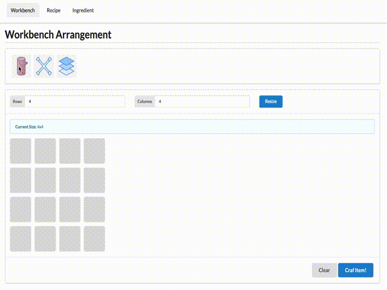
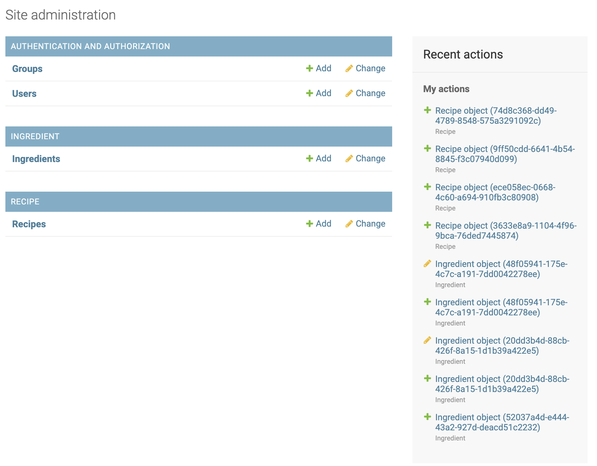

# Item Crafter

**Item Crafter** is a web app where you can craft items with the given ingredients according to the available recipes. This web is built using ReactJS and Django. It runs on top of docker container.



# Table of Contents

* [Set Up Instructions](#set-up-instructions)
* [API Documentation](#api-documentation)
* [Running Unit Tests](#running-unit-tests)
* [Features](#features)
* [Administrator Access](#administrator-access)

# Features

The web consists of 3 main features:

* [Workbench](#workbench)
* [Recipe](#recipe)
* [Ingredient](#ingredient)

## Workbench

In *workbench*, basically you can put some items on top of the workbench. The items you can use are provided in the upper bar. You can drag the items, and drop it on top of the grey boxes grid (representing the workbench). You can arrange the position of the items in such way that it would match any of the *recipes*. Once you're done with the arrangement, you can try to click *"Craft Item!"* button to process it. If it matches exactly one of the available recipes, an item will be crafted for you, otherwise you'll get certain error messages.

Apart from that, you can also resize the workbench to your needs. You can remove or replace specific items that you've put on the workbench in case you need to change the arrangement. Not only removing specific items, you can also clean all items on the workbench at once by clicking *"Clear" button.


## Recipe

Like its name, *recipe* is meant to show you what recipes are available in the database. You can then try to arrange items in your workbench to match exactly one of these to craft an item. You can add new recipe, but it will require an admin access that will be explained in another section.


## Ingredient

*Workbench* requires you to put some items on it, here is where you can find the available items registered in the database. Same as the recipe, you can add more ingredients, but it requires admin access.


# Administrator Access

Admin page is accessible in `http://localhost:8000/admin`. You can add new ingredient and recipe once you can login as an administrator.



# Set Up Instructions

1. Install docker, follow docker's official guide [here](https://www.docker.com/get-started)
2. Clone this repository
3. Move to the project's root directory
4. Run `docker compose up` and wait until all the container is started and the server is running
5. The frontend app will be accesssible in port `3000` while the backend in port `8000`

However this configuration is only prepared and intended for development environment, and not ready for production grade. To make it production-ready, there will be more actions to do.

# API Documentation

Below is listed all the utilized endpoint in this app:

## Get List of Ingredients

Endpoint:
```
GET /api/ingredients/
```
Request Body:
```
None
```
Sample Response:
```
[
    {
        "id": "52037a4d-e444-43a2-927d-deacd51c2232",
        "name": "Wood",
        "representation": "W",
        "illustration_url": "https://img.icons8.com/dusk/64/000000/wood.png"
    },
    {
        "id": "20dd3b4d-88cb-426f-8a15-1d1b39a422e5",
        "name": "Iron",
        "representation": "I",
        "illustration_url": "https://img.icons8.com/ultraviolet/80/000000/tire-iron.png"
    },
    {
        "id": "48f05941-175e-4c7c-a191-7dd0042278ee",
        "name": "Glass",
        "representation": "G",
        "illustration_url": "https://img.icons8.com/ultraviolet/80/000000/layers.png"
    }
]
```
## Get List of Recipes

Endpoint:
```
GET /api/recipes/
```
Request Body:
```
None
```
Sample Response:
```
[
    {
        "id": "3633e8a9-1104-4f96-9bca-76ded7445874",
        "name": "Shovel",
        "representation": "W\r\nW\r\nI",
        "illustration_url": "https://img.icons8.com/cotton/64/000000/fire-shovel.png"
    },
    {
        "id": "ece058ec-0668-4c60-a694-910fb3c80908",
        "name": "Magnifying Glass",
        "representation": "G\r\nW\r\nW",
        "illustration_url": "https://img.icons8.com/cotton/64/000000/detective.png"
    },
    {
        "id": "9ff50cdd-6641-4b54-8845-f3c07940d099",
        "name": "Saw",
        "representation": "__I\r\n_I_\r\nW__",
        "illustration_url": "https://img.icons8.com/plasticine/100/000000/saw.png"
    },
    {
        "id": "74d8c368-dd49-4789-8548-575a3291092c",
        "name": "Bucket",
        "representation": "I_I\r\n_I_",
        "illustration_url": "https://img.icons8.com/cotton/64/000000/paint-bucket.png"
    }
]
```
## Craft Item

Endpoint:
```
POST /api/workbench/
```
Request Body:
```
rowSize: workbench's row size
columnSize: workbench's row size
arrangement: workbench's row size
```
Sample Request Body:
```
{
    rowSize: 4,
    columnSize: 4,
    arrangement: {
        2|2: "W",
        1|2: "W",
        0|2: "G"
    }
}
-----
Note: arrangement data is formated as <row_index>|<col_index>
```
Sample Response:
```
{
    "status": "SUCCESS",
    "message": "An item is successfully crafted!",
    "craftable_items": [
        {
            "recipe": {
                "id": "3633e8a9-1104-4f96-9bca-76ded7445874",
                "name": "Shovel",
                "representation": "W\r\nW\r\nI",
                "illustration_url": "https://img.icons8.com/cotton/64/000000/fire-shovel.png"
            },
            "matches": 0
        },
        {
            "recipe": {
                "id": "ece058ec-0668-4c60-a694-910fb3c80908",
                "name": "Magnifying Glass",
                "representation": "G\r\nW\r\nW",
                "illustration_url": "https://img.icons8.com/cotton/64/000000/detective.png"
            },
            "matches": 1
        },
        {
            "recipe": {
                "id": "9ff50cdd-6641-4b54-8845-f3c07940d099",
                "name": "Saw",
                "representation": "__I\r\n_I_\r\nW__",
                "illustration_url": "https://img.icons8.com/plasticine/100/000000/saw.png"
            },
            "matches": 0
        },
        {
            "recipe": {
                "id": "74d8c368-dd49-4789-8548-575a3291092c",
                "name": "Bucket",
                "representation": "I_I\r\n_I_",
                "illustration_url": "https://img.icons8.com/cotton/64/000000/paint-bucket.png"
            },
            "matches": 0
        }
    ]
}
```

# Running Unit Tests

### Backend:

Get into container's terminal using `docker compose exec backend bash`, and run this command below
```
./manage.py test
```

### Frontend:
Get into container's terminal using `docker compose exec frontend sh`, and run this command below
```
yarn test
```