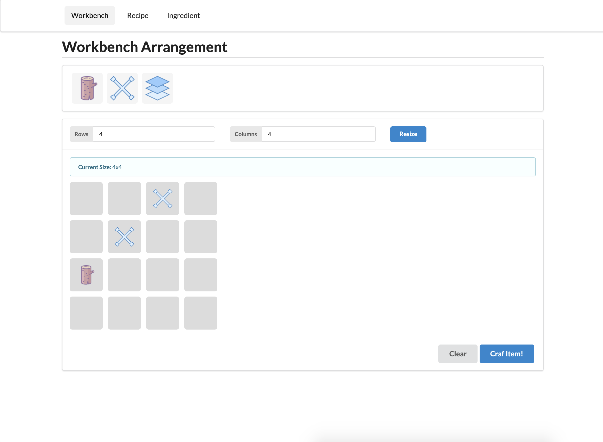
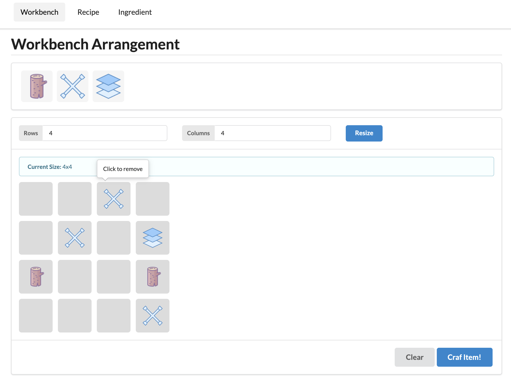
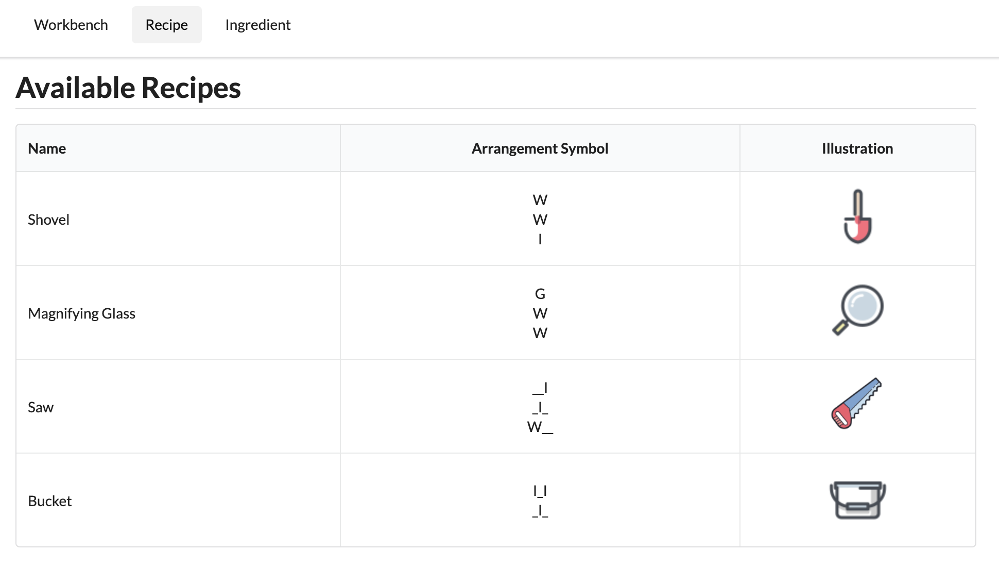
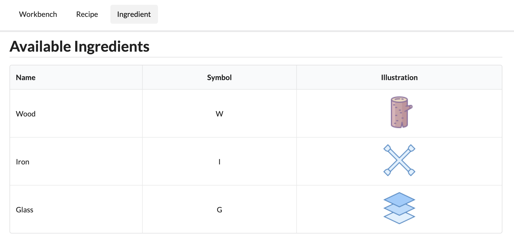

# Item Crafter

**Item Crafter** is a web app where you can craft items with the given ingredients according to the available recipes. This web is built using ReactJS and Django. It runs on top of docker container.

# Features

The web consists of 3 main features:

* [Workbench](#workbench)
* [Recipe](#recipe)
* [Ingredient](#ingredient)

## Workbench

In *workbench*, basically you can put some items on top of the workbench. The items you can use are provided in the upper bar. You can drag the items, and drop it on top of the grey boxes grid (representing the workbench). You can arrange the position of the items in such way that it would match any of the *recipes*. Once you're done with the arrangement, you can try to click *"Craft Item!"* button to process it. If it matches exactly one of the available recipes, an item will be crafted for you, otherwise you'll get certain error messages.

Apart from that, you can also resize the workbench to your needs. You can remove or replace specific items that you've put on the workbench in case you need to change the arrangement. Not only removing specific items, you can also clean all items on the workbench at once by clicking *"Clear" button.

## Recipe

Like its name, *recipe* is meant to show you what recipes are available in the database. You can then try to arrange items in your workbench to match exactly one of these to craft an item. You can add new recipe, but it will require an admin access that will be explained in another section.

## Ingredient

*Workbench* requires you to put some items on it, here is where you can find the available items registered in the database. Same as the recipe, you can add more ingredients, but it requires admin access.

